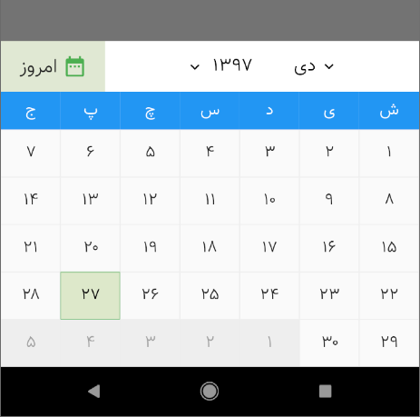

### Installation

Depend on it

```sh
dependencies:
  persian_datepicker: ^1.1.7
```
Install it

```sh
flutter packages get
```

Import it

```sh
import 'package:persian_datepicker/persian_datepicker.dart';
```

# Persian DatePicker & simple date converter
A persian ( farsi ) datepicker for flutter.  
**two mostly used functions: jalali-to-gregorian and gregorian-to-jalali are added to package** to avoid adding other packages to just do the date conversion.  

to see an example, refer to `Date Conversion` section in this page.

### Usage

A simple example with a TextField which turns into a datepicker

**main.dart**

```dart

import 'package:flutter/material.dart';
import 'package:persian_datepicker/persian_datepicker.dart';


void main() {
  runApp(Home());
}

class Home extends StatefulWidget {
  @override
  HomeState createState() {
    return new HomeState();
  }
}

class HomeState extends State<Home> {

  // our text controller
  final TextEditingController textEditingController = TextEditingController();

  PersianDatePickerWidget persianDatePicker;

  @override
  void initState() {

    /*Simple DatePicker*/
    persianDatePicker = PersianDatePicker(
      controller: textEditingController,
//      datetime: '1397/06/09',
    ).init();

    super.initState();
  }

  @override
  Widget build(BuildContext context) {
    return MaterialApp(
      home: Scaffold(
        appBar: AppBar(title: Text('دیت پیکر ساده'),),
        body: Builder(builder: (BuildContext context) {


          return Container(
            child: TextField(
              enableInteractiveSelection: false, // *** this is important to prevent user interactive selection ***
              onTap: () {
                FocusScope.of(context).requestFocus(new FocusNode()); // to prevent opening default keyboard
                showModalBottomSheet(
                    context: context,
                    builder: (BuildContext context) {
                      return persianDatePicker;
                    });
              },
              controller: textEditingController,
            ),
          );


        }),
      ),
    );
  }
}

```

### HOW IT LOOKS

**Simple DatePicker**


<br>
<br>
<br>
<br>

**Range DatePicker**

```dart
/*Range DatePicker*/
persianDatePicker = PersianDatePicker(
  controller: textEditingController,
  rangeDatePicker: true,
  // datetime: '1397/06/09',
  // finishDatetime: '1397/06/15',
).init();

```


<br>
<br>
<br>
<br>

**Inline DatePicker**

```dart
/*Inline DatePicker*/
persianDatePicker = PersianDatePicker(
  controller: textEditingController,
  datetime: '1397/06/19',
).init();


....


return Column(
  children: <Widget>[
    // Simple Date Picker
    Container(
      child: persianDatePicker, // just pass `persianDatePicker` variable as child with no ( )
    ),
    TextField(
      enabled: false,
      controller: textEditingController,
    ),
  ],
);
```


<br>
<br>
<br>
<br>

**Customized DatePicker**

You can customize datepicker as you wish, there are a lot of options to set, below code is just a few of them.

```dart
/*Customized DatePicker*/
persianDatePicker = PersianDatePicker(
    controller: textEditingController,
    outputFormat: 'YYYY/MM/DD',
    datetime: '1397/08/29',
    finishDatetime: '1397/08/30',
    daysBorderWidth: 3,
    weekCaptionsBackgroundColor: Colors.red,
    headerBackgroundColor: Colors.blue.withOpacity(0.5),
    headerTextStyle: TextStyle(color: Colors.blue, fontSize: 17),
    headerTodayIcon: Icon(Icons.access_alarm, size: 15,),
    datePickerHeight: 280
).init();
```


<br>
<br>
<br>


```dart
/*Customized Font Family ( Farsi Digits )*/
persianDatePicker = PersianDatePicker(
    controller: textEditingController,
    farsiDigits: true
).init();
```

Or if you have a font which supports farsi digits then you can simply pass the font name and everything would be ok  

اگر فونتی در برنامه استفاده کرده اید که قابلیت نمایش اعداد فارسی را دارد تنها لازم است اسم فونت را به دیت پیکر بدهید

```dart
/*Customized Font Family ( Farsi Digits )*/
persianDatePicker = PersianDatePicker(
    controller: textEditingController,
    fontFamily: 'Vazir' // here I used Vazir font
).init();
```




<br>
<br>
<br>


### Events

`onChange`: fires after tapping on a day. It has two arguments, `oldText` and `newText` which represents the value of datepicker before-tap and after-tap respectively.

```dart
persianDatePicker = PersianDatePicker(
  controller: textEditingController,
  onChange: (String oldText, String newText) {
    print(oldText);
    print(newText);
  }
).init();
```


<br>
<br>
<br>
<br>

### Date Conversion

You can convert farsi to english ( jalali to gregorian ) and vice versa using following methods

```dart
/*Range DatePicker*/

PersianDateTime.gregorianToJalaali(
      datetime: '2019-02-05',
      outputFormat: 'YYYY/MM/DD');
// output => 1397/11/16
```

if you want to get an object back, then just set `returnObject` to `true`

```dart
GenericDateInfo JDI = PersianDateTime.gregorianToJalaali(
    datetime: '2019-02-05',
    returnObject: true);
print(JDI);

/* Output
{
    year: 1397
    shortYear: 97
    month: 11
    zeroLeadingMonth: 11
    day: 16
    zeroLeadingDay: 16
    monthName: بهمن
    shortMonthName: null
}
*/

GenericDateInfo GDI = PersianDateTime.jalaaliToGregorian(
    datetime: '1397/11/16',
    returnObject: true);
print(GDI);
/* Output
{
    year: 2019
    shortYear: 19
    month: 2
    zeroLeadingMonth: 02
    day: 5
    zeroLeadingDay: 05
    monthName: February
    shortMonthName: Feb
}
*/
```

<br>
<br>
<br>
<br>

### conversion output formats

`YYYY` full year  
`YY` 2 digits year  
`MMMM` full month name  ( **doesn't work in datepicker** )
`MMM` short month name ( this only works in gregorian dates and also **doesn't work in datepicker** )
`MM` leading zero month digit  
`M` month without leading zero
`DD` leading zero day digit  
`D` day without leading zero 


<br>
<br>
<br>
<br>


### Important Notes نکات مهم

up to this version all output dates are in persian.  

تا این نسخه تمام تاریخ های خروجی پارسی(جلالی) هستند


`rangeSeparator` and your custom date separator should not be equal, otherwise datepicker will return null  

مقدار ورودی `rangeSeparator` و جداکننده ای که برای فرمت خروجی انتخاب کرده اید نباید یکی باشند در این صورت دیت پیکر خروجی `جداکننده های محدوده و خروجی مشابه هستند` برمیگرداند

<br>

Persian **input** dates must respect `YYYY/MM/DD` format. output format is up to you  
Gregorian **input** dates must respect `YYYY-MM-DD` format. output format is persian and up to you    

فرمت تاریخ های ورودی که پارسی (جلالی) هستند **باید** بصورت 
`YYYY/MM/DD`
باشد. فرمت خروجی به دلخواه شماست  

فرمت تاریخ های ورودی که میلادی هستند **باید** بصورت
`YYYY-MM-DD`
باشد. فرمت تاریخ خروجی، پارسی و به دلخواه شما خواهد بود

<br>

### Examples
You can find the full example in the Git Repository, example directory
