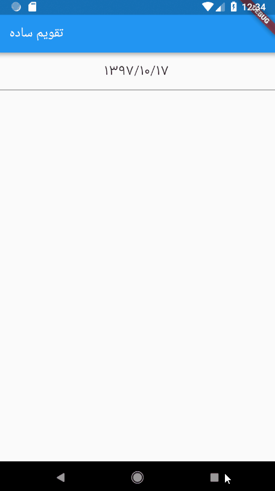
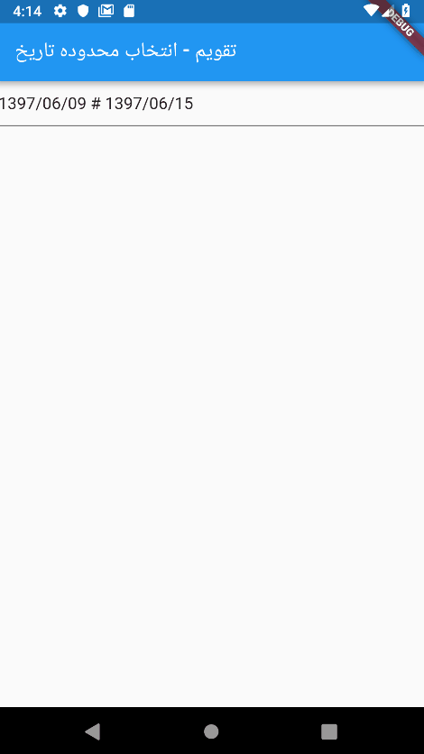
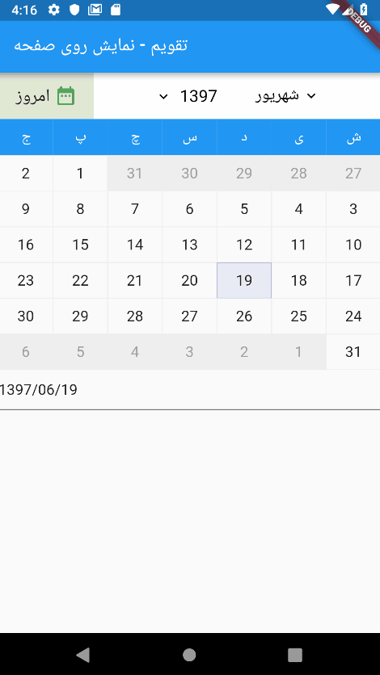
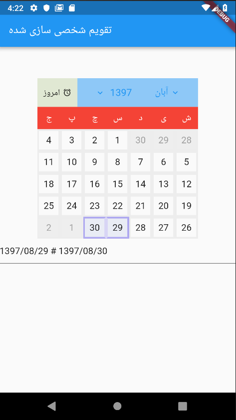

# Persian Datepicker
A persian ( farsi ) datepicker for flutter.

### Installation

Depend on it

```sh
dependencies:
  persian_datepicker: ^1.0.4
```
Install it

```sh
flutter packages get
```

Import it

```sh
import 'package:persian_datepicker/persian_datepicker.dart';
```

### Usage


A simple example with a TextField which turns into a datepicker

**main.dart**

```sh

import 'package:flutter/material.dart';
import 'package:persian_datepicker/persian_datepicker.dart';


void main() {
  runApp(Home());
}

class Home extends StatefulWidget {
  @override
  HomeState createState() {
    return new HomeState();
  }
}

class HomeState extends State<Home> {

  // our text controller
  final TextEditingController textEditingController = TextEditingController();

  PersianDatePickerWidget persianDatePicker;

  @override
  void initState() {


    /*Simple DatePicker*/
    persianDatePicker = PersianDatePicker(
      controller: textEditingController,
      datetime: '1397/06/09',
      outputFormat: 'YYYY/MM/DD',
    ).initialize();

    super.initState();
  }

  @override
  Widget build(BuildContext context) {
    return MaterialApp(
      home: Scaffold(
        appBar: AppBar(title: Text('تقویم ساده'),),
        body: Builder(builder: (BuildContext context) {


          return Container(
            child: TextField(
              onTap: () {
                FocusScope.of(context).requestFocus(new FocusNode()); // to prevent opening default keyboard
                showModalBottomSheet(
                    context: context,
                    builder: (BuildContext context) {
                      return persianDatePicker;
                    });
              },
              controller: textEditingController,
            ),
          );


        }),
      ),
    );
  }
}

```

### HOW IT LOOKS

**Simple Datepicker**



<br>
<br>
<br>
<br>

**Range Datepicker**

```
/*Range DatePicker*/
persianDatePicker = PersianDatePicker(
  controller: textEditingController,
  datetime: '1397/06/09',
  finishDatetime: '1397/06/15',
  outputFormat: 'YYYY/MM/DD',
).initialize();

```



<br>
<br>
<br>
<br>

**Inline Datepicker**

```
/*Inline DatePicker*/
persianDatePicker = PersianDatePicker(
  controller: textEditingController,
  datetime: '1397/06/19',
  outputFormat: 'YYYY/MM/DD',
).initialize();


....


return Column(
  children: <Widget>[
    // Simple Date Picker
    Container(
      child: persianDatePicker, // just pass `persianDatePicker` variable as child with no ( )
    ),
    TextField(
      controller: textEditingController,
    ),
  ],
);
```



<br>
<br>
<br>
<br>

**Customized Datepicker**

You can customize datepicker as you wish, there are a lot of options to set, below code is just a few of them.

```
/*Customized DatePicker*/
persianDatePicker = PersianDatePicker(
    controller: textEditingController,
    outputFormat: 'YYYY/MM/DD',
    datetime: '1397/08/13',
    finishDatetime: '1397/08/17',
    daysBorderWidth: 3,
    weekCaptionsBackgroundColor: Colors.red,
    headerBackgroundColor: Colors.blue.withOpacity(0.5),
    headerTextStyle: TextStyle(color: Colors.blue, fontSize: 17),
    headerTodayText: Text('امروز', style: TextStyle(fontSize: 15),),
    headerTodayIcon: Icon(Icons.access_alarm, size: 15,),
    datePickerHeight: 280
).initialize();
```




<br>
<br>
<br>


### Options

The controller of the input which you want to connect it to datepicker. This parameter is **required**  
کنترلر تکست فیلدی که میخواهید به دیت پیکر تبدیل کنید
```
TextEditingController controller @required
```
<hr>

Persian input datetime   
ورودی دیت پیکر به فرمت تاریخ پارسی 
```
String datetime     Default: today date
```

<hr>

Persian input finish datetime, if this option is set, then datepicker changes to range datepicker  
ورودی دیت پیکر برای تاریخ پایان به فرمت پارسی، اگر این ورودی ست شود، دیت پیکر به صورت محدوده ای خواهد بود
```
String finishDatetime
```

<hr>

Gregorian input datetime  
ورودی دیت پیکر به فرمت تاریخ میلادی
```
String gregorianDatetime
```

<hr>

Gregorian finish datetime, if this option is set, then datepicker changes to range datepicker  
ورودی دیت پیکر برای تاریخ پایان به فرمت گرگورین، اگر این ورودی ست شود، دیت پیکر به صورت محدوده ای خواهد بود
```
String gregorianFinishDatetime
```

<hr>

Output format of the datepicker ( display format )
فرمت خروجی نمایش تاریخ  

* YYYY  ( four digits year سال به صورت چهار رقمی )
* YY    ( two digits year سال به صورت دو رقمی )
* MM    ( 0 lead month ماه با صفر در ابتدای عددهای کمتر از 10 )
* M     ( month number ماه بدون صفر در ابتدای عددهای کمتر از 10 )
* DD    ( 0 lead day number روز با صفر در ابتدای اعداد کمتر از 10 )
* D    ( day number روز بدون صفر در ابتدای اعداد کمتر از 10 )
```
String outputFormat     Default: YYYY/MM/DD
```

<hr>


Range output or input is two dates beside to each other with a separator between them which is `rangeSeparator`, default value is ` # `  
فرمت ورودی یا خروجی محدوده به صورت دو تاریخ کنار هم با یک جدا کننده است. این ورودی همان جدا کننده است که مقدار پیش فرض آن `#` میباشد
```
String rangeSeparator     Default: #
```

<hr>

The height of your datepicker  
ارتفاع دیت پیکر
```
double datePickerHeight     Default: 320
```

<hr>

When you tap on the year caption, a tiny dialog appears with an animation, this option handles the `Duration` of appearing the dialog  
زمانیکه روی عنوان سال کلیک میکنید، دیالوگ کوچکی ظاهر میشود، این ورودی مدت زمان ظاهر شدن دیالوگ را مشخص میکند
```
Duration yearSelectionAnimationDuration      Default: 400 milliseconds
```

<hr>

The year dialog box `Curve` type  
نوع انیمیشن دیالوگ انتخاب سال
```
Curve yearSelectionAnimationCurve     Default: elasticOut
```

<hr>

When you tap on the month caption, a tiny dialog appears with an animation, this option handles the `Duration` of appearing the dialog  
زمانیکه روی عنوان ماه کلیک میکنید، دیالوگ کوچکی ظاهر میشود، این ورودی مدت زمان ظاهر شدن دیالوگ را مشخص میکند
```
Duration monthSelectionAnimationDuration     Default: 400 milliseconds
```

<hr>

The month dialog box `Curve` type  
نوع انیمیشن دیالوگ انتخاب ماه

```
Curve monthSelectionAnimationCurve
```

<hr>

The background color of selected  year in year-selection-dialog  
**رنگ پس زمینه سال انتخاب شده در **دیالوگ انتخاب سال
```
Color yearSelectionBackgroundColor
```

<hr>


Text style of year selection dialog box  
استایل متن در دیالوگ انتخاب سال
```
TextStyle yearSelectionTextStyle
```

<hr>

The background color of selected year in year selection dialog box  
رنگ پس زمینه سال انتخاب شده در دیالوگ انتخاب سال
```
Color yearSelectionHighlightBackgroundColor
```

<hr>


Text style of selected year in year selection dialog box  
استایل متن سال انتخاب شده در دیالوگ انتخاب سال
```
TextStyle yearSelectionHighlightTextStyle
```

<hr>

The background color of selected  month in year-selection-dialog  
**رنگ پس زمینه ماه انتخاب شده در **دیالوگ انتخاب ماه

```
Color monthSelectionBackgroundColor
```

<hr>

Text style of month selection dialog box  
استایل متن در دیالوگ انتخاب ماه

```
TextStyle monthSelectionTextStyle
```

<hr>

The background color of selected year in year selection dialog box  
رنگ پس زمینه سال انتخاب شده در دیالوگ انتخاب سال

```
Color monthSelectionHighlightBackgroundColor
```

<hr>


Text style of selected month in month selection dialog box  
استایل متن ماه انتخاب شده در دیالوگ انتخاب ماه

```
TextStyle monthSelectionHighlightTextStyle
```

<hr>

Background color of week captions  
رنگ پس زمینه عناوین هفته
```
Color weekCaptionsBackgroundColor
```

<hr>

Text style of week captions  
استایل متن عناوین هفته
```
TextStyle weekCaptionsTextStyle
```

<hr>


Background color of header  
رنگ پس زمینه هدر
```
Color headerBackgroundColor
```

<hr>

Text style of header texts, The icons near header captions also take their effect by this option  
استایل متن، ماه و سال هدر. آیکون های کنار ماه و سال هم از این پارامتر تاثیر میگیرند
```
TextStyle headerTextStyle
```

<hr>

background color of days  
رنگ پس زمینه روزها
```
Color daysBackgroundColor
```

<hr>

```
Color daysFontColor
```

<hr>

```
Color currentDayBackgroundColor
```

<hr>

```
Color currentDayFontColor
```

<hr>

```
Color selectedDayBackgroundColor
```

<hr>

```
Color selectedDayFontColor
```

<hr>

```
Color headerTodayBackgroundColor
```

<hr>

```
Color disabledDayBackgroundColor
```

<hr>

```
Color disabledDayFontColor
```

<hr>

```
Text headerTodayText
```

<hr>

```
Icon headerTodayIcon
```

<hr>

```
Color daysBorderColor
```

<hr>

```
Color selectedDayBorderColor
```

<hr>

```
Color selectedDaysInnerBorderColor
```

<hr>

```
Color todayBorderColor
```

<hr>

```
double daysBorderWidth
```

<br>
<br>


### Important Notes نکات مهم
`rangeSeparator` and your custom date separator should not be equal, otherwise datepicker will return null  
مقدار ورودی `rangeSeparator` و جداکننده ای که برای فرمت خروجی انتخاب کرده اید نباید یکی باشند در این صورت دیت پیکر خروجی `جداکننده های محدوده و خروجی مشابه هستند` برمیگرداند

<br>
<br>

### Examples
You can find the full example in the example directory
